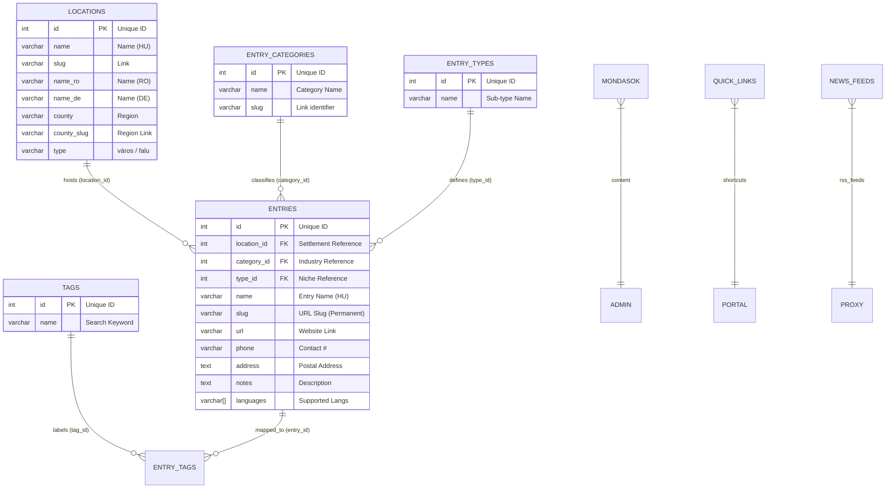

# Lamsza Platform: Definitive Architecture Overview

This document serves as the single source of truth for the Lamsza platform architecture. It details the data model, backend API, administrative capabilities, and the public frontend user journey.

---

## 1. Database Architecture (PostgreSQL)

The system revolves around a central directory of entries (services/businesses) linked to a robust location and classification system.

### 1.1 Data Schema & Relationships

The database utilizes a strict relational schema to maintain platform-wide alignment.

**Database Schema & Relationship Map:**

### 1.2 Supporting Tables
- **`mondasok`**: Daily sayings for the homepage (`id`, `text`, `category`).
- **`quick_links`**: Actionable tiles on the homepage with custom `bg_color` and `url`.
- **`news_feeds`**: RSS sources (`id`, `title`, `feed_url`, `bg_color`) used for the aggregator.

---

## 2. Backend Infrastructure (Golang)

The backend acts as a high-performance proxy and data-integrity layer. It handles slug generation, diacritic normalization, and external API orchestration.

### 2.1 Core API & Lookup Logic
- **Auto-Slugification**: The backend uses a centralized `slugify` function to strip diacritics and normalize names into URL-safe strings. Slugs are automatically managed to ensure absolute routing consistency.
- **Multilingual Search Aliases**: The directory search engine supports **Hungarian, Romanian, and German** location names. A query for "Miercurea Ciuc" (RO) or "Szeklerburg" (DE) will resolve to "Csíkszereda" records at the SQL level via name-aliasing logic.
- **Weather Resolution**: The `/api/weather` endpoint resolves settlement slugs to geographical names to ensure provider compatibility (OpenWeatherMap).

### 2.2 Endpoint Registry

| Endpoint | Method | Interaction | Description |
| :--- | :--- | :--- | :--- |
| `/api/directory` | GET | SELECT + JOIN | Primary engine for search. Supports multilingual name aliases and diacritic-insensitive lookups. |
| `/api/service` | GET | SELECT WHERE slug| Detailed view for individual businesses including tags and metadata. |
| `/api/locations` | GET | SELECT * | Returns settlement lists used for navigation. |
| `/api/weather` | GET | Proxy | Fetches real-time weather using database-to-API name resolution. |
| `/api/county_news` | GET | Logic | Regional news aggregator. Resolves location slugs to filter and prioritize local content. |
| `/api/proxy` | GET | RSS Fetcher | Bypasses CORS and normalizes external news data. |

---

## 3. Admin Panel (UX & Control)

The Admin panel is a unified management suite designed for speed and safety.

### 3.1 Unified UX Patterns
- **Modal-Based Editing**: All administrative edits occur within high-focus modals. Row-inline editing has been eliminated.
- **Protected Actions**: Every "Edit" and "Delete" action is protected by the `showConfirm` dialog.
- **Style Consistency**: The UI uses standardized CSS utility classes for layout instead of inline styles.

---

## 4. Public Frontend (User Journey)

The frontend is a SvelteKit SPA designed for maximum visibility (SEO) and user engagement.

### 4.1 Navigation Hierarchy
- **Breadcrumbs**: Standardized navigation trail (Home → [County] → [Settlement] → [Entry]). Uses `settlementType` (város, falu) for accurate final labels.
- **Regional Hubs**: Settlement pages serve as regional news and weather hubs, dynamically fetching content based on the location slug.

### 4.2 Key Features
- **Weather Sync**: Displays real-time conditions on settlement pages.
- **Saying of the Day**: Randomized or category-specific insights fetched from `mondasok`.
- **Smart Directory**: Filters results by settlement, category, and tags in real-time.

---

## 5. System Alignment (Symmetry Fixes)

The platform is optimized for **Zero Misalignment**:
1.  **DB => Backend**: Auto-slugification ensures identifiers always match.
2.  **Multilingual Aliasing**: Supports search in HU, RO, and DE seamlessly.
3.  **Regional Logic**: News and Weather respond to the geographical context of the active slug.
4.  **Admin Protection**: Human error is minimized via unified modals and confirmation dialogs.
