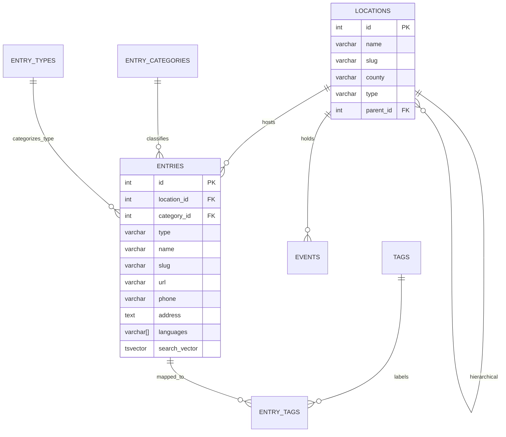

# Lamsza Platform: Definitive Architecture Overview

This document serves as the single source of truth for the Lamsza platform architecture. It details the data model, backend API, administrative capabilities, and the public user journey.

---

## 1. Database Architecture (PostgreSQL)

The system revolves around a central directory of **entries** linked to a robust location and classification system.

### 1.1 Data Schema & Relationships

The database utilizes a strict relational schema with advanced search capabilities.

**Core Directory Schema (Entries, Locations, Events):**

### 1.2 Advanced Search (Full-Text Search)
The platform implements a high-performance search engine using PostgreSQL Full-Text Search:
- **Weighted Relevance**: Results are ranked using `ts_rank_cd` with the following priority:
  - **Weight A (Highest)**: Entry Name.
  - **Weight B**: Location Name (and aliases name_ro, name_de).
  - **Weight C**: Entry Category and Tags.
  - **Weight D (Lowest)**: Entry Notes and Address.
- **GIN Index**: A Generalized Inverted Index on the `search_vector` column enables sub-millisecond lookups.
- **Normalization**: Backend `slugify` logic ensures search queries are diacritic-neutral.

---

## 2. Backend Infrastructure (Golang)

The backend is built with Go using a modular, package-based architecture.

### 2.1 Package-Based Architecture
- **`internal/config`**: Centralized configuration and `.env` loading.
- **`internal/db`**: Database connection pool and lifecycle.
- **Feature Modules**: `internal/news`, `internal/events`, `internal/weather`, `internal/mondasok`, `internal/links`, `internal/search`, `internal/venues`.
- **Accounts**: `internal/auth` (Google sign-in, sessions) and `internal/account` (preferences, links, history, favorites, listing ownership, websites).

### 2.2 Service Management
The platform uses a standardized process-based management system:
- **`scripts/restart_all.sh`**: Orchestrates a full restart of the Database (Docker), Backend (Go), and Frontend (Vite).
- **Process Isolation**: Backend and Frontend run as separate background processes with dedicated logging (`server_backend.log`, `server_frontend.log`) and PID tracking.

---

## 3. Public Frontend (SvelteKit)

The frontend follows a strict component-based architecture.

### 3.1 Component-Based Architecture
UI components located in `$lib/components/`:
- **Widget Library**: `WeatherWidget`, `NewsWidget`, `EventsWidget`, `MondasWidget`.
- **Core UI**: `EntryCard` (standardized entry rendering), `SearchEngine`.

### 3.2 Active Navigation States
The header toolbar dynamically highlights the active route using SvelteKit's `$page` store, applying an `.active` class to the current navigation button and its sub-pages.

---

## 4. System Alignment (Zero Misalignment)
1. **Universal Naming**: "Entry" is the standard nomenclature across Backend, Frontend, and Database layers.
2. **Multilingual Aliasing**: Search supports HU, RO, and DE seamlessly.
3. **Environment Reliability**: Robust `.env` loading allows execution from any subdirectory.

---

## 5. Accounts and the homepage place

Signed-in state is a Google session. The Fiók page (`/fiok`) holds the person's own listings, websites, favorites, history, and links. Settings (`/beallitasok`) hold theme, quick-link count, and one saved settlement (`users.preferred_settlement_id`).

Homepage weather and the events ticker follow that saved settlement. If it is empty, weather uses the admin `my_location_slug` and the events ticker lists every location. Favorite places are a separate list. They do not choose the homepage settlement. A favorite látnivaló that has coordinates still adds an extra weather widget.

## 6. Directory websites

`websites` stores a submitted domain, title, and short description. A signed-in user submits one from the Weboldalak index. An admin approves, rejects, or bans it. Approved sites appear on `/index/weboldalak`. Claiming a site can create an unpublished listing. New listings are started from the Index dialog, not from Fiók.

## 7. Product version

The public version is the first object in `src/lib/publicChangelog.js`. The footer and `/valtozasnaplo` render that list. `changelog.md` is the developer copy. The current published version is v1.2.0.
